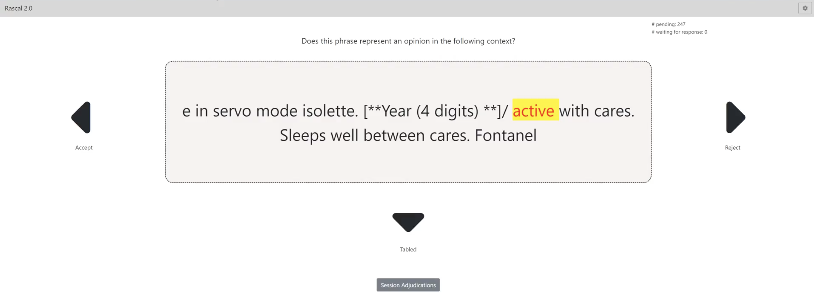
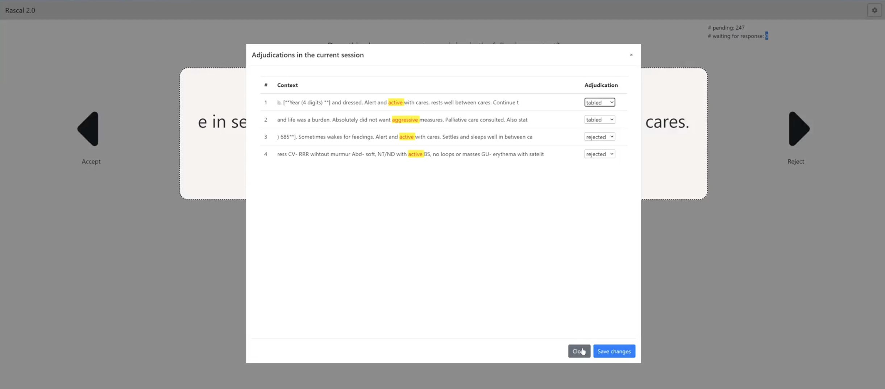

# A clinician-generated dataset for detecting implicit biases in electronic patient records.

Subjectivity is very context dependent in clinical notes, we use active learning and a BERT model to extract subjective language from clinical notes in MIMIC-III, to support analysis of differential correlations across sensitive patient groups, as well as to explore how subjectivity relates to objective clinical outcomes.

# Annotation Task
Clinical experts label phrases in context, considering a 50-character window before and after each lexicon word. The annotation is performed through a user interface, where clinical experts accept or reject each phrase presented by answering the question: "Does this phrase represent an opinion in the given context?"





# Acknowledgement

If you use code or concepts available in this repository, we would be grateful if you would cite the data as described in the PhysioNet project page:

```
Moukheiber, D., Wahed, M., Alfonso, P., Pile, P. T., Sy, A. J., Taliño, M. K., Alberto, I.,
Flores, G., Alberto, N., Villanueva, J. L., Legaspi, K., Tan, J. E., Terdiman, J., Celi, L. A.,
Wu, J., Gruhl, D., & Lourentzou, I. (2025). 
*A clinician-generated dataset for detecting implicit biases in electronic patient records* 
(version 0.1.0). PhysioNet. RRID:SCR_007345. 
https://doi.org/10.13026/*****
```